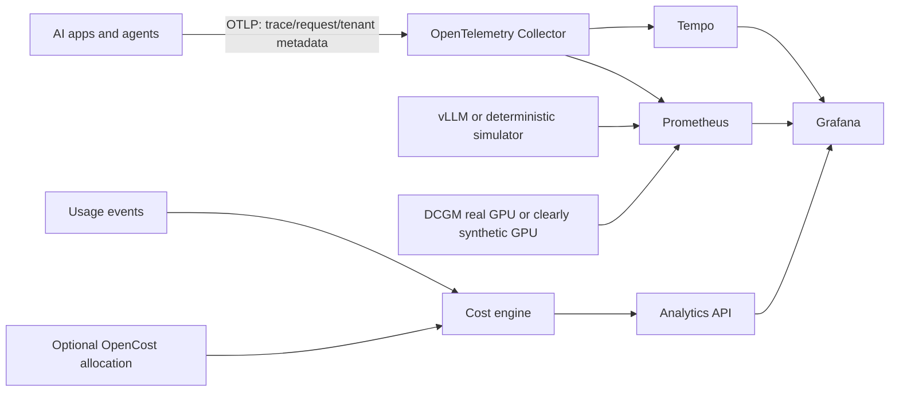

# Architecture

```mermaid
flowchart LR
  A[AI apps and agents] -->|OTLP: trace/request/tenant metadata| C[OpenTelemetry Collector]
  C --> T[Tempo]
  C --> P[Prometheus]
  V[vLLM or deterministic simulator] --> P
  G[DCGM real GPU or clearly synthetic GPU] --> P
  U[Usage events] --> E[Cost engine]
  O[Optional OpenCost allocation] --> E
  E --> API[Analytics API]
  P --> GR[Grafana]
  T --> GR
  API --> GR
```

Grafana presents data. The API owns pricing selection, attribution, SLO calculation, tenant authorization and request-to-cost analysis.
