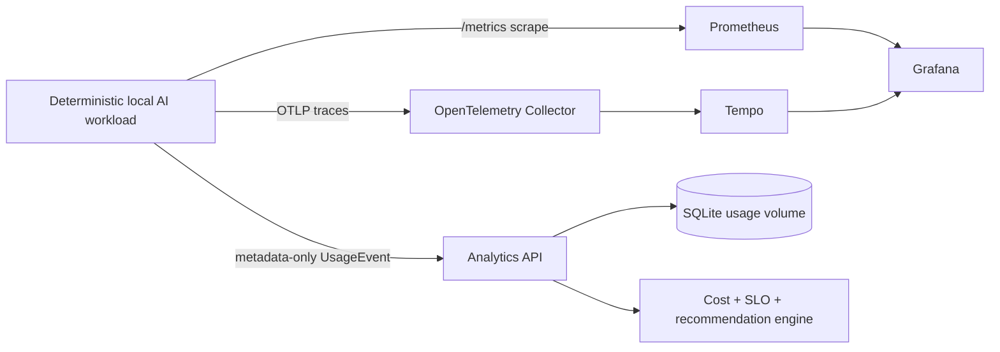

# Architecture

## Executed local path

The workload accepts a local OpenAI-shaped completion request. It creates a request ID and trace ID,
emits bounded Prometheus measurements, exports an OTLP span, and sends a `UsageEvent` containing
only operational metadata to the analytics API. The analytics API stores live events in a
project-scoped SQLite volume, calculates versioned token-price estimates plus an explicitly
simulated GPU-time component, and exposes tenant-scoped request analysis, SLO, unit-economics, and
recommendation endpoints.

The workload waits for metadata ingestion before returning. If analytics ingestion fails, it emits
an ingestion-failure metric and marks the trace rather than recording the prompt or completion.
The workload itself stays available; this is a deliberate data-quality boundary, not an exactly-once
delivery guarantee.

## State and recovery

Fixture events load at startup for deterministic tests. Live events are inserted by `event_id` into
SQLite using `INSERT OR IGNORE`, so replaying the same event is idempotent. The Compose named volume
retains live metadata across analytics API container restart. `make demo-recovery` is the executed
proof.

## Evidence boundaries

Prometheus and Tempo receive genuine local telemetry from the running workload. Prices are local,
versioned estimates. GPU-time cost is simulated; neither physical GPU usage nor DCGM data is
collected. Production adapters such as vLLM, OpenCost, cloud billing, a warehouse, and managed
observability are not part of the executed local path.
