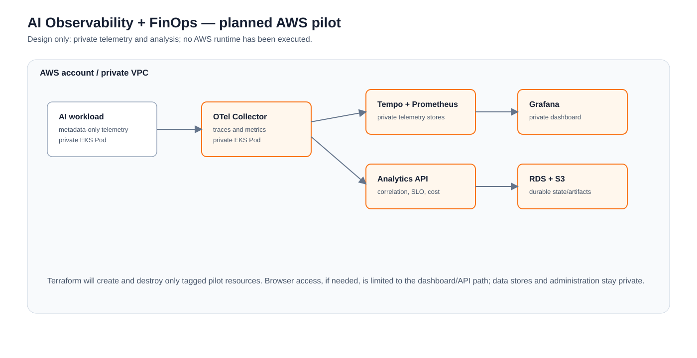

# Planned AWS Cloud Architecture

This is a design target, not AWS execution evidence.



```text
AI workload → OpenTelemetry Collector → Tempo / Prometheus → Grafana
                     ↓
                Analytics API → RDS correlation and cost state
                     ↓
        private EKS · ECR · IAM/IRSA · Secrets Manager · S3 when needed
```

In plain English: the platform will collect safe request metadata, correlate it with
traces and metrics, calculate estimated cost, and show whether an SLO was met. The
workload, analytics API, and observability tools stay private. Terraform will manage
the VPC, EKS, storage, identity, and teardown. A narrow ALB is planned only if a
browser needs the dashboard/API; Prometheus, Tempo, Grafana administration, databases,
Kubernetes, and secrets will not be public.

The cloud pilot must prove the same story that already runs locally: request ID →
trace → metric → tenant/model/token metadata → cost/SLO explanation. GPU cost remains
simulated until real hardware telemetry is measured.
